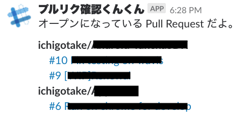

# gapps-pr2slack

Post opened Pull Request list to Slack for the specified GitHub owner(orgs or users).



## Usage

```
npm run deploy
```

## Setup

### 1. Create *standalone* Google Apps Script on Google Drive

>Your add-on must be developed as a standalone script and tested within Doc or Sheet. This means that it cannot use certain functions of bound scripts, namely installable triggers. While testing within a Doc, you have access to the "Special methods" mentioned in the docs, though. If you followed the quickstart above, you should be set up correctly.

ref: [https://github.com/danthareja/node-google-apps-script](https://github.com/danthareja/node-google-apps-script)

### 2. Deploy

Setup this.

```
npm install
# OAuth2 client is enabled Google Drive API
npm run auth path/to/client_secret_xxxxxx.apps.googleusercontent.com.json
npm run init $gapps_file_id
$EDITOR .env
```

and deploy!

```
npm run deploy
```

## 3. Setup Trigger

Open Google Apps Script and setup Trigger.

